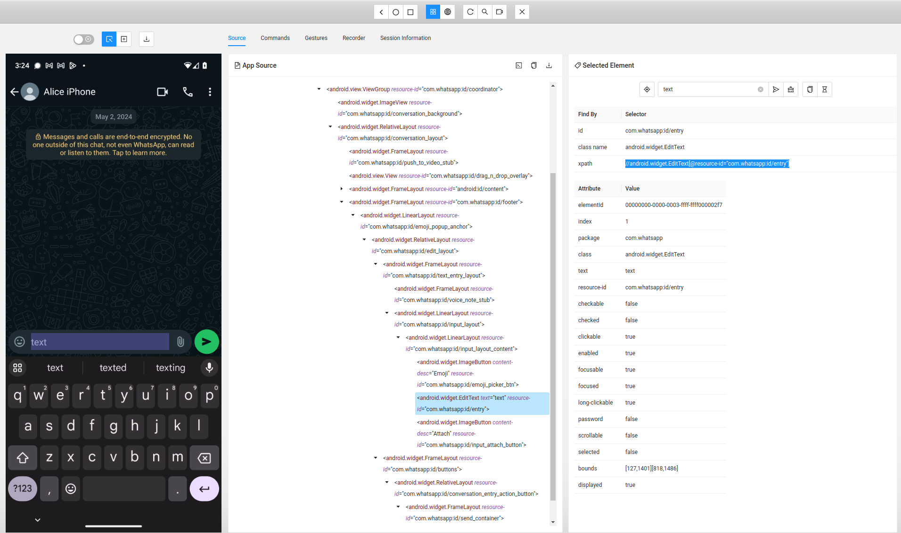

# Contributing to the Appium Automation Project

Thank you for considering contributing to our project! By following these guidelines, you will help ensure that our project remains consistent, maintainable, and easy to use.

## Table of Contents
<!-- TOC -->
* [Contributing to the Appium Automation Project](#contributing-to-the-appium-automation-project)
  * [Table of Contents](#table-of-contents)
  * [Development Installation](#development-installation)
  * [Issues](#issues)
  * [Pull Requests](#pull-requests)
  * [Development requirements](#development-requirements)
  * [Coding Standards](#coding-standards)
  * [Documentation](#documentation)
    * [App Version Support:](#app-version-support)
  * [How to add a new application](#how-to-add-a-new-application)
  * [How to write Appium actions](#how-to-write-appium-actions)
    * [Example: writing new Appium actions](#example-writing-new-appium-actions)
    * [Navigation](#navigation)
    * [Case Sensitivity in XPATH:](#case-sensitivity-in-xpath)
    * [Elements that do not have identifying attributes](#elements-that-do-not-have-identifying-attributes)
  * [Supporting new app versions](#supporting-new-app-versions)
  * [Resources](#resources)
  * [License](#license)
<!-- TOC -->

## Development Installation
To contribute to the project, follow the following installation steps: 

- Follow the installation steps in the [README.md](README.md)
- Install [Appium Inspector](https://github.com/appium/appium-inspector)
- Install Puma by cloning the repository:
```bash
git clone git@github.com:NetherlandsForensicInstitute/puma.git
```
- Create a virtual environment and install Python dependencies:
```bash
cd puma
python3.11 -m venv env
source env/bin/activate 
pip install -r requirements.txt
```

## Issues
- Open an issue for bug reports, feature requests, or general feedback.
- When opening an issue, please provide as much detail as possible, including screenshots, and steps to reproduce for bug reports. If the issue is about a specific app, include its package name and version.


## Pull Requests
- All contributions to the project must be submitted via pull request.
- Ensure that your pull request addresses a specific issue or feature request. If none exists, please open a new issue first to discuss the changes you'd like to make.
- Follow the [GitHub Flow](https://guides.github.com/introduction/flow/) workflow:
  1. Create a new branch from `main`. The branch name should start with the issue number. When adding support for a new
  version of an application, please do this in 1 single issue.
  2. Make your changes and commit them with descriptive commit messages. See the sections [Adding New Functionality](#adding-new-functionality) or [Supporting new app versions](#supporting-new-app-versions).
  3. Submit a pull request to the main repository's `main` branch.
- Ensure that your code adheres to the project's [coding standards and conventions](#coding-standards).
- Provide a clear and detailed description of your changes in the pull request description.


## Coding Standards
- **PEP Compliance**: Adhere to PEP 8 for code style. Use PEP 484 for typing hints. Refer to the [PEP 8 documentation](https://www.python.org/dev/peps/pep-0008/) for guidelines.
- **Typing Hints**: Use typing hints on all method signatures, including arguments and return values.
- **Documentation**: PyDoc should be in the reStructuredText style, and include the parameters and return value.


## Documentation
- **Pydoc**: Add pydoc to all methods, fully explaining the method, its arguments, and any limitations. Protected methods (prefixed with `_`) do not need documentation.
- **Update App README**: If a new major feature is added (e.g., stickers, pictures, calls), update the application-specific README to reflect these changes.

### App Version Support:
Any pull request to the `main` branch must **fully** support a specific version of the application. (See [Supporting new app versions](#supporting-new-app-versions)) This version should be
newer than the version currently supported by the codebase.


## How to add a new application
When adding support for a new application, make sure to add a new class to the correct location(eg `apps/android). Class template:
```python
from puma.apps.android.appium_actions import supported_version, AndroidAppiumActions

APPLICATION_PACKAGE = 'TODO'

@supported_version("YOUR VERSION")
class ApplicationActions(AndroidAppiumActions):
    def __init__(self,
                 device_udid,
                 desired_capabilities: Dict[str, str] = None,
                 implicit_wait=1,
                 appium_server='http://localhost:4723'):
        """
        Class with an API for Application using Appium. Can be used with an emulator or real device attached to the computer.
        """
        AndroidAppiumActions.__init__(self,
                                      device_udid,
                                      APPLICATION_PACKAGE,
                                      desired_capabilities=desired_capabilities,
                                      implicit_wait=implicit_wait,
                                      appium_server=appium_server)
```
- Add the desired functionality (see [the next section](#how-to-write-appium-actions))
- Add a README for this app and add a link to the project README
- Add a test script in the [test scripts directory](test_scripts), in which each function is tested.
- Add your class to the list of apps in [publish_app_tags](.github/scripts/publish_app_tags.py)

## How to write Appium actions
Appium is a framework for testing applications, based on Selenium. In this project, we use Appium to execute actions on the device.
In this context, we define functions in Python that exist of one or more `Appium actions`. An Appium action is a one
action on the phone, for instance tapping on an element. In our Python code, we define functions executing one or more
Appium actions, for instance `send_message()` where the message box is tapped, text is added to the box and the send button is clicked.(See example below)
When supporting different apps of the same type, for instance chat apps, these function need to be implemented for each
app, as the specific elements differ for each application.
So, Telegram has a `send_message` function, and WhatsApp has a different `send_message` function.

### Example: writing new Appium actions
- Start both Appium and Appium Inspector
- Connect your device and start a session with the application. Use the following capability set template and fill in your UDID (run `adb devices`):
    ```json
    {
      "platformName": "Android",
      "appium:options": {
        "automationName": "UiAutomator2",
        "platformVersion": "16.0",
        "deviceName": "Android",
        "udid": "FILL IN YOUR UDID HERE",
        "noReset": true
      }
    }
    ```
- Use Appium Inspector to identify UI elements. For example, to inspect the text box for sending a message, click on the
element in the phone display. In the middle pane, the element is highlighted in the xml tree. In the right pane, all attributes of the element are shown.

- Choose a unique attribute to select the element on. `content-desc` is the preferred attribute, but is not always
present. In this case, choose the resource id with value `com.whatsapp:id/entry`. Appium Inspector gives a suggestion
for the xpath to use. If the attribute value is language dependent, (e.g., "send message" vs. "stuur bericht"),
ensure that it supports English.
- Use `by=AppiumBy.XPATH`. There are other options, for instance `AppiumBy.ID`, but `XPATH` is more reliable in our experience.
  - To send a message in Python code, define a function send_message with the following steps:
  - #TODO test
      ```python
    def send_message(text):
        text_box = self.driver.find_element(by=AppiumBy.XPATH, value="//android.widget.EditText[@resource-id='com.whatsapp:id/entry'")
        # Type text. The keyboard is not part of an application, but is native to the device, hence send_keys is used.
        text_box.send_keys(text)
        #Inspect the Send message button and add
        self.driver.find_element(by=AppiumBy.XPATH, value="//android.widget.ImageButton[@content-desc="Send"]").click()
      ```
- When adding a new function add this function to the test script.

### Navigation
Be aware of navigation within the app. For example, sending message to a specific contact can only be done if currently 
in that chat. Think how this should be handled by the end user and note this in the PyDoc. Code-wise, it is more 
appealing to the end user if the function handles the navigation themselves, for instance by supplying the chat 
contact name as a parameter (see whatsapp.send_message()). However, performance-wise this is not really desirable, 
as for each message sent navigation to the home screen and back into the chat is required. Thus, this is really 
dependent on the situation. The example of WhatsApp mentioned above allows both, so this is a good solution.

### Case Sensitivity in XPATH:
XPATH is case-sensitive by default. As the element attribute values regularly change, and sometimes the only change is casing, use case insensitivity as much as possible:
To make an XPATH expression case-insensitive, you can do the following:
  ```xpath
  //*[lower-case(@attribute) = 'value']
  ```

### Elements that do not have identifying attributes
For some apps, the elements do not have any identifying attributes. In that case, you can use the OCR util function
`click_text_ocr()` from the `appium_util`. This code uses OCR to identify text on a screenshot of the phone, and clicks on the corresponding
coordinates. Note that this is not the preferred way, but sometimes this is inevitable.

> :warning: The `click_text_ocr()` method can only click on single words, as the underlying OCR tool (tesseract) can only recognize single words and not sentences.
Keep this in mind when writing code: for example if you want to click the text `continue game`, you need to call `click_ocr(`continue`).


## Supporting new app versions
When you notice the code no longer works on a newer app version, you can update the code to work for the new version.
- To diagnose which functionality does not work anymore for the new version, run the <TODO test script>, which verifies
each function for an app and reports which ones do not work anymore. Make sure to run it after you have finished as well.
- Make sure that all functions in the application class for the specific app version works again, also when you might only be interested in some
of them. For example, when you have a script that sends a few messages and you want to update this in the Appium code
for WhatsApp, also make sure sending a picture and calling still works.
- The most common cause for the code not working for a specific app version anymore is the change of an attribute value.
For example, the resource id for the WhatsApp text box changed from `com.whatsapp:id/entry` to `com.whatsapp:id/whatsappEntry`.
This needs to be updated in the xpath used to find the element.
- **Do not make the code backwards compatible with older versions**, just update the code to work for the new version.
This ensures the code remains readable. For older versions the user can go back to a dedicated release for that version.
- Also perform the following actions:
  - Update the version annotation in the class
  - Refer to the test script provided in our repository for guidelines on creating these tests.


## Resources
- XPATH is a powerful selector for XML documents. Learn about XPATH syntax from resources like [W3Schools XPATH Tutorial](https://www.w3schools.com/xml/xpath_intro.asp).
- Appium is an open-source project and ecosystem of related software, designed to facilitate UI automation of many app platforms. See the [Appium website](http://appium.io/docs/en/latest/).


## License
By contributing to this project, you agree that your contributions will be licensed under the project's [LICENSE](LICENSE.txt).